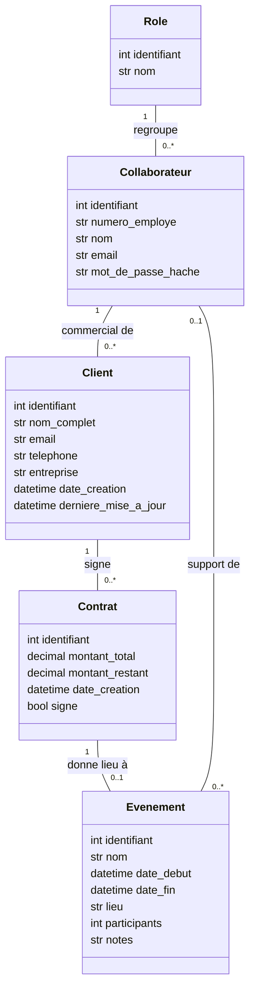

# Diagramme de classes

```mermaid
classDiagram
    class Role {
        int identifiant
        str nom
    }
    class Collaborateur {
        int identifiant
        str numero_employe
        str nom
        str email
        str mot_de_passe_hache
    }
    class Client {
        int identifiant
        str nom_complet
        str email
        str telephone
        str entreprise
        datetime date_creation
        datetime derniere_mise_a_jour
    }
    class Contrat {
        int identifiant
        decimal montant_total
        decimal montant_restant
        datetime date_creation
        bool signe
    }
    class Evenement {
        int identifiant
        str nom
        datetime date_debut
        datetime date_fin
        str lieu
        int participants
        str notes
    }

    Role "1" -- "0..*" Collaborateur : regroupe
    Collaborateur "1" -- "0..*" Client : commercial de
    Client "1" -- "0..*" Contrat : signe
    Contrat "1" -- "0..1" Evenement : donne lieu à
    Collaborateur "0..1" -- "0..*" Evenement : support de
```
